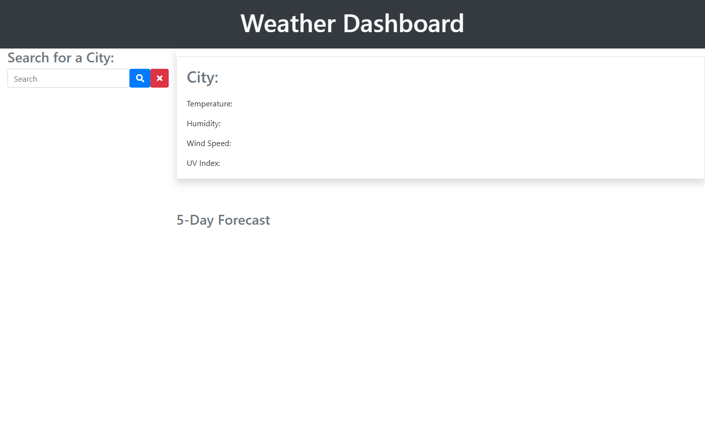
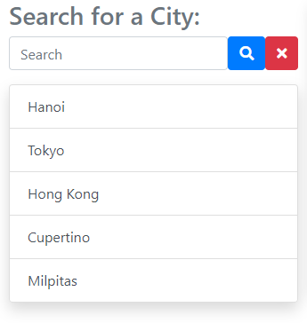
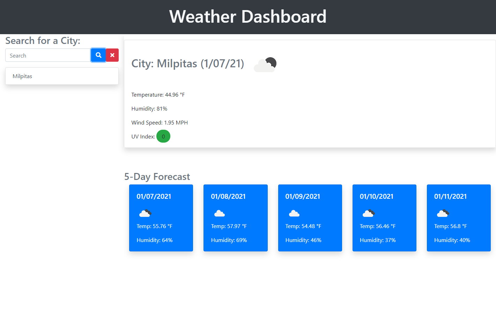
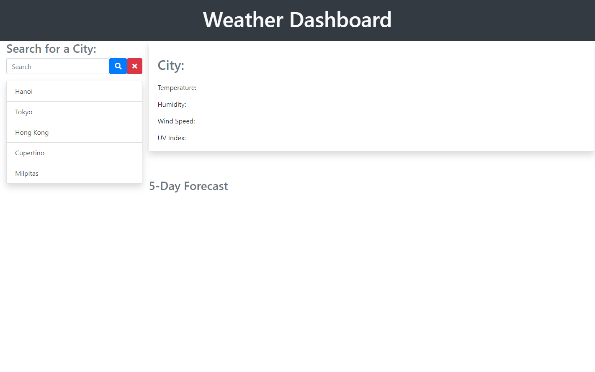

I am a leaf on the wind. Watch how I soar!

-----------------------
## Table of Contents
1. [Description](#description)
2. [Deployed Link](#deployed-link)
3. [How to Start](#how-to-start)
4. [Code Snippet](#code-snippet)
5. [Prerequisites](#prerequisites)
6. [Installation Instructions](#installation-instructions)
7. [Built with](#built-with)
8. [Licenses](#licenses)
9. [Author](#author)
10. [Acknowledgements](#acknowledgements)

-----------------------
## Description


Knowing what to expect from the weather is beneficial to planning out one's day. With the Weather Dashboard you can do just that.

The WEather dashboard retrieves data from the OpenWeather API and provides the user with weather data for a given city as well as a 5 day forecast. This application utilizes dynamically updated HTML and CSS
Developers are often tasked with retrieving data from another application's API and using it in the context of their own. Third-party APIs allow developers to access their data and functionality by making requests with specific parameters to a URL. Your challenge is to build a weather dashboard that will run in the browser and feature dynamically updated HTML and CSS.
Use the OpenWeather API to retrieve weather data for cities. The documentation includes a section called "How to start" that will provide basic setup and usage instructions. Use localStorage to store any persistent data.


-----------------------
## Deployed Link
https://akhalid88.github.io/weather-forecast/

-----------------------
## How to Start
Upon loading the webpage, the user is greeted with the following dawhboard



The user must enter a search term in the left side search bar and can either press Enter on their keyboard or the blue search icon next to the input field. The user can also clear the search history by clicking on the red X icon in the same area



Once the user enters a search term, the right side of the page will populate with the desired cities weather info and the search term will be added to the search history below the search bar. There is a max limit of 10 items in the search history. The data provided is as follows
- City name with current date and icon depicting weather conditions
- Current temperature in Fahrenheit
- Current humidity levels
- Current wind speed
- UV index with additional styling based on EPA guidelines
	- Green = favorable, Yellow = moderate, Red = severe, Black = beyond severe

Additionally, a 5-day weather forecast is also provided
- The date of the day in question
- An icon depicting the weather conditions
- The temperature of each day
- The humidity levels for that day



Lastly, the user is also able to view previous search terms in the Search history list. clicking on any of the cities in the history will provide that city's info.



-----------------------
## Code Snippet

This wasa an interesting challenge. I started by creating a template of how I wanted the webpage to look using HTML/CSS and Bootstrap. Once I had developed it to my desired style, I was able to use jQuery to create the assocaited html elements with the appropriate bootstrap classes , weather info, and append it all to the webpage in the right order.

TEMPLATE HTML/CSS
```
<div class="card text-white bg-primary shadow mb-5 rounded">
	<div class="card-body">
		<h5 class="card-title">01/08/2021</h5>
		
		<p class="card-text">Temp: 47.82 °F</p>
		<p class="card-text">Humidity: 53%</p>
	</div>
</div>
...
```


DYNAMICALLY GENERATED HTML/CSS
```
var newDate = forecast.list[i].dt_txt.split(" ", 1)
newDate = newDate[0].split("-")
newDate = newDate[1] + "/" + newDate[2] + "/" + newDate[0];

var newForeCastItem = $("<div>").addClass("col");
var newBlueCard = $("<div>").addClass("card text-white bg-primary shadow mb-5 rounded");
var newCardBody = $("<div>").addClass("card-body");
var newcardTitle = $("<h5>").addClass("card-title").text(newDate);
var newIcon = "https://openweathermap.org/img/wn/" + forecast.list[i].weather[0].icon + ".png";
var newCardImage = $("").attr("src", newIcon);
var newTemp = $("<p>").addClass("card-text").text("Temp: " + forecast.list[i].main.temp + " \u00B0F");
var newHumi = $("<p>").addClass("card-text").text("Humidity: " + forecast.list[i].main.humidity + "%");

newCardBody.append(newcardTitle).append(newCardImage).append(newTemp).append(newHumi);
newBlueCard.append(newCardBody);
newForeCastItem.append(newBlueCard);
$("#forecast-area").append(newForeCastItem);
```

The webpage displays a list of recently used search terms for the users convenience. This data is persistent and stored in local storage. In order to not let the search history grow too long, I placed a max limit of 10 most recent searches. I make a simple check before saving the array to local Storage to see if the array is greater than 10, if so, I use .pop to remove the last element of the array.

```
function savetoStorage(array) {
	if (array.length > 10) {
		array.pop();
	}
	localStorage.setItem("history", JSON.stringify(array));
```

-----------------------
## Prerequisites
A computer with an active internet connection and a web browser

-----------------------
## Installation instructions
None

-----------------------
## Built with

- OpenWeather API
- Moment.js
- jQuery
- Javascript
- Bootstrap
- HTML
- CSS
- Git
- Github

-----------------------
## Licenses
This Project is licensed under MIT license

-----------------------
## Author

Muhammad A Khalid

[LinkedIn](https://www.linkedin.com/in/abdullahkhalid/)
<br>
[GitHub](https://github.com/akhalid88)

-----------------------
## Acknowledgements
- Jerome Chenette (Instructor)
- Manuel Nunes (TA)
- Mahisha Manikandan (TA)
- UC Berkeley Coding Bootcamp